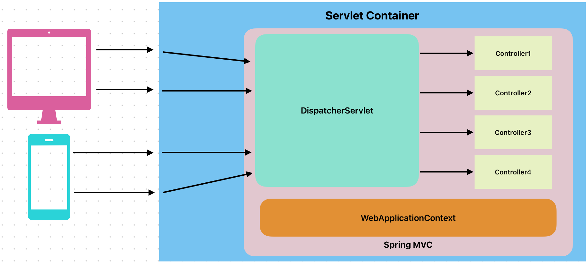
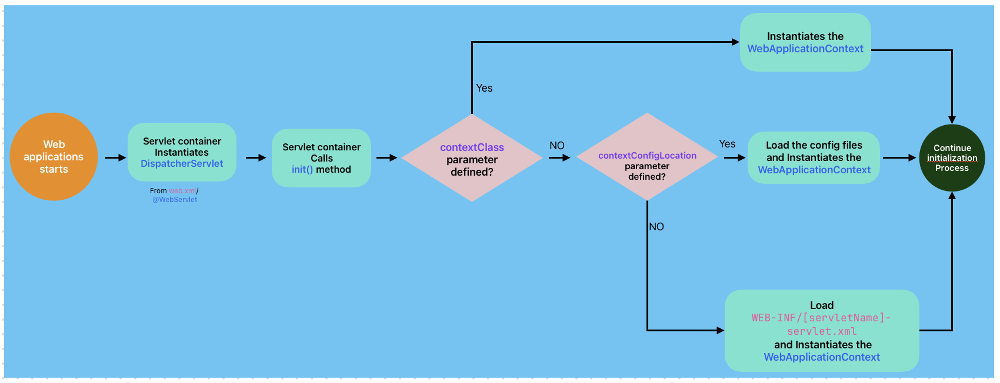
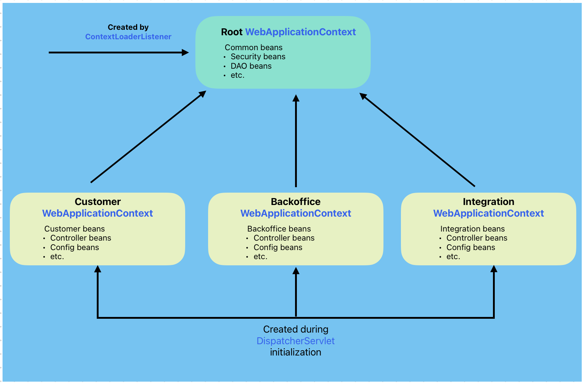
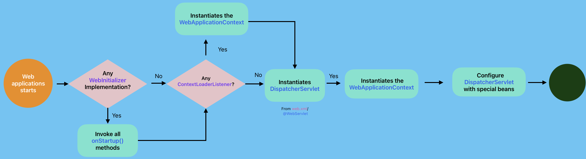
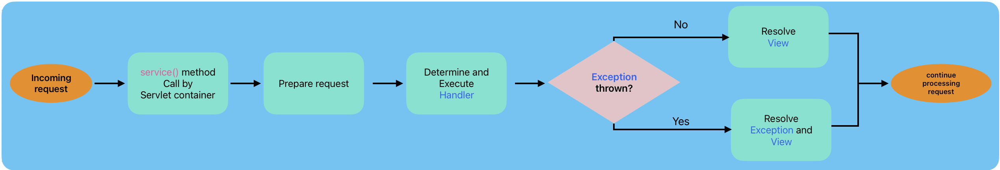
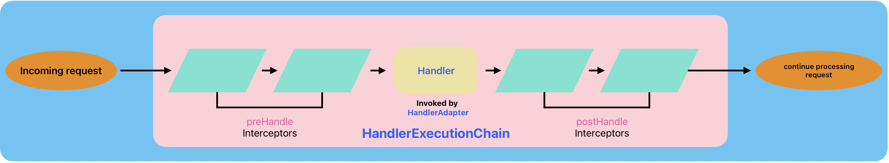
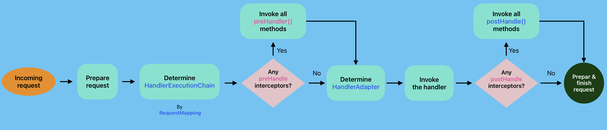

= Spring MVC Unveiled: How It Leverages Servlet Technology
Ahmed Ali Rashid <https://github.com/ahmedjaad>
1.0, Nov 20, 2024: Detailing Spring & Servlet
:toc: preamble
:icons: font
:servlet_basics-dev-to-url: https://dev.to/ahmedjaad/servlet-the-foundation-of-java-web-technology-okh
:git-repo-url: https://github.com/ahmedjaadi/spring-mvc-unveiled
:dev-to-series-url: https://dev.to/ahmedjaad/series/29876

* This is the second article in the {dev-to-series-url}[Inside Spring] series.
If you haven’t read the first part, {servlet_basics-dev-to-url}[Servlet: The Foundation of Java Web Technology],
we recommend doing so even if you're familiar with the topic, it is a great refresher.
* We’ve mixed XML and annotation-based configurations to broaden your understanding of Spring and the Servlet API,
and for illustration purposes, not a preference for XML, modern practices favor annotations.
* This article is accompanied by source code on {git-repo-url}[GitHub].
Following along with the code, while reading will help you better understand the concepts discussed.

== Introduction

Back in 2013, as I began exploring Spring, I had a basic grasp of Servlet technology but couldn’t quite understand why deploying a Spring MVC application required Tomcat, a Servlet container, despite not writing a single Servlet.

I also wondered how Spring's `ApplicationContext` was initialized,
or how Tomcat mapped HTTP requests without definitions in the deployment descriptor.
Fast-forward 11 years, and with Spring Boot’s rise, answering these questions has only grown more challenging.

In this article, we’ll attempt to answer these questions by exploring how Servlet technology bootstraps and configures a Spring MVC application, how Spring MVC dispatches requests to the right handlers, and finally, how all of this integrates seamlessly with Spring Boot.

We won’t go into the details of the MVC pattern, the concept of a front controller, or the basics of the Spring Framework. It’s assumed that you already understand what the `ApplicationContext` is and its role in a Spring application. If these concepts are new to you, I encourage exploring the many excellent resources available to learn about them.

== Bootstrapping and Configuring Spring MVC
Since you're here, you likely know what {servlet_basics-dev-to-url}#what-is-a-servlet[a servlet is], so let’s view Spring MVC from a fresh perspective: it’s essentially one giant, powerful, and highly customizable servlet.

NOTE: While typically there’s one `DispatcherServlet` in a Spring MVC application, multiple can be configured if needed. +
Spring MVC creates and maintains one `ApplicationContext` per `DispatcherServlet`,
each of these servlets operates in their own namespace and resources

At its core, Spring MVC revolves around a single servlet, the `DispatcherServlet`, which handles every incoming request. Spring essentially tells the Servlet API:

[quote,Spring MVC to Servlet API]
____
I’ll use you to bootstrap and configure myself. Once that’s done, forward all requests to me—I’ll handle them better.

____

.Here’s how Spring MVC leverages Servlet technology to bootstrap and configure itself:
. *Request Mapping*: The servlet container maps all requests to the `DispatcherServlet`, enabling Spring MVC to control the request-handling lifecycle.
. *ApplicationContext Creation*: The servlet container instantiates and initializes the `DispatcherServlet`, which itself initializes the Spring `ApplicationContext`.
. *Self-Configuration*: When the servlet container calls `init()` on the `DispatcherServlet`, it configures itself based on the application’s setup.
. *Programmatic Initialization*: Spring allows developers to influence the initialization process using the `ServletContainerInitializer` interface and the `@HandlesTypes` annotation.
. *Hierarchical WebApplicationContext Structure*: Spring uses the `ContextLoaderListener`, an implementation of `ServletContextListener`,  to create and initialize a root `WebApplicationContext`, establishing a hierarchy where the root context provides shared beans to all `DispatcherServlet` instances.

There isn’t that much more to say about the first point. Spring maps requests to the `DispatcherServlet` using the `<servlet-mapping>` element in `web.xml` or the `urlPatterns` attribute of the `@WebServlet` annotation.
For dynamic servlet registration, it relies on the `addMapping()` method of the `ServletRegistration` interface.

Now, let’s take a closer look at the remaining four points.

=== ApplicationContext Creation

When a `DispatcherServlet` is registered statically, either via `web.xml` or the `@WebServlet` annotation,
the servlet container uses its default no-argument constructor to instantiate it,
the servlet container then calls the servlet's `init()` lifecycle method. +

Spring MVC takes advantage of the `init()` method call by loading a configuration file named `[servletName]-servlet.xml` from the WEB-INF directory,
and then creates and initializes an instance of `WebApplicationContext`, a sub-interface of `ApplicationContext`.

Spring offers flexibility through the `contextConfigLocation` initialization parameter, which allows you to specify alternative XML configuration files. Similarly, the `contextClass` parameter lets you define the `ApplicationContext` implementation to use, typically a class like `AnnotationConfigWebApplicationContext.`

For greater control, the `DispatcherServlet` provides methods to set these values. A preferred approach is to extend the `DispatcherServlet` and override its default constructor to configure these parameters programmatically.

==== Practical Example: Dedicated DispatcherServlet for Integration
In our banking application, suppose we want a `DispatcherServlet` named `integrationAppServlet` dedicated to third-party integrations.
We can register it in `web.xml` as follows:

[source,xml]
.web.xml
----
    <servlet>
        <servlet-name>integrationAppServlet</servlet-name>
        <servlet-class>org.springframework.web.servlet.DispatcherServlet</servlet-class>
        <load-on-startup>1</load-on-startup>
    </servlet>
    <servlet-mapping>
        <servlet-name>integrationAppServlet</servlet-name>
        <url-pattern>/integration/*</url-pattern>
    </servlet-mapping>
----

Spring MVC will then look for a configuration file named `WEB-INF/integrationAppServlet-servlet.xml`. Here's how it might look:
[source,xml]
.integrationAppServlet-servlet.xml
----
        <!-- xmlns declarations removed for brevity -->
<beans>
    <context:component-scan base-package="spring_mvc_unveiled.integration"/>
</beans>
----
This setup instructs Spring MVC to scan the `spring_mvc_unveiled.integration` package for beans, create a `WebApplicationContext` with them, and associate that context with the `integrationAppServlet`.
This servlet will handle all requests with the `/integration` URL pattern.

[NOTE]
====
The static registration of `DispatcherServlet` is demonstrated in `web.xml` and `WEB-INF/integrationAppServlet-servlet.xml`. +
For `@WebServlet` registration, see the `CustomerAppServlet` class and its nested `CustomerAppApplicationContext` class.
====

=== Self-Configuration
Spring not only creates the `WebApplicationContext` for the `DispatcherServlet` during its `init()` method call but also registers essential beans called link:https://docs.spring.io/spring-framework/reference/web/webmvc/mvc-servlet/special-bean-types.html[Special Bean Types].
`DispatcherServlet` delegates the real work of processing requests to these beans, there are eight such bean types in total, but discussing all of them is beyond the scope of this article.
To provide clarity on what Spring MVC configures within the `DispatcherServlet,` we’ll briefly highlight three key examples:

* `HandlerMapping`: This bean helps `DispatcherServlet`  determine the bean that will handle a request, for instance in our banking application, in the `BalanceController` class we have the `balance()` method which is annotated with `@GetMapping` annotation, when a `GET` `/customer/balance` request comes `DispatcherServlet` 's way, it will ask the `HandlerMapping` bean to map the request to the right handler, the `HandlerMapping` bean will then map the request to the `BalanceController#balance` method.
The implementation of `HandlerMapping` that supports mapping of methods annotated with `@RequestMapping` is `RequestMappingHandlerMapping`

[#_handler_exception_resolver]
* `HandlerExceptionResolver`: If an exception is thrown during mapping or processing of a request,`DispatcherServlet` will ask a bean of type `HandlerExceptionResolver` to determine an exception handler.
You've probably used the `@ControllerAdvice` and `@ExceptioHandler` annotation to globally handle exceptions in your applications, you might have thought it was magic that calls you methods, I'm here to tell it is not, it's actual an implementation of  `HandlerExceptionResolver` by name `ExceptionHandlerExceptionResolver` that does this

[#_view_resolver]
* `ViewResolver`: When your handler return a String, Spring MVC assumes it is a name of a view, and the `DispatcherServlet` will ask a bean of type `ViewResolver` to resolve the real view that will be returned to the client

As already mentioned Spring MVC configures the `DispatcherServlet` with these beans by first checking if the programmer defined these beans, if not it will go ahead with the default strategy that creates all the beans that the `DispatcherServlet` needs.

If customization is needed, you can either provide your own beans of these types, and Spring will pick them up, or use the `@EnableWebMvc` annotation with the `WebMvcConfigurer` interface.
This approach allows fine-grained control over the Spring MVC flow while still leveraging the framework's defaults where needed.

=== Programmatic Initialization

Programmers can implement the `WebApplicationInitializer` interface, which includes a single method: `onStartup(ServletContext servletContext)`.
Spring MVC calls this method and provides the `ServletContext` instance,
allowing developers to perform tasks during the application startup.
This gives developers a say over the initialization process.

But how does Spring achieve this? It uses `SpringServletContainerInitializer`, an implementation of {servlet_basics-dev-to-url}#servletcontainerinitializer[ServletContainerInitializer] which is annotated with `@HandlesTypes(WebApplicationInitializer.class)`.
As explained in the {servlet_basics-dev-to-url}#servletcontainerinitializer[ServletContainerInitializer] section, the servlet container passes all instances of `WebApplicationInitializer` to the `onStartup` method of `SpringServletContainerInitializer`.
Spring then invokes the `onStartup` method of each `WebApplicationInitializer` instance
and provides the `ServletContext` instance.

==== Practical Example: Dedicated DispatcherServlet for Backoffice
Given the multi-module nature of our banking app, a dedicated `DispatcherServlet` is needed
to handle backoffice requests under the `/back_office` URL path.
By implementing the `WebApplicationInitializer` interface, we can dynamically register a `DispatcherServlet` without relying on annotations or `web.xml`. Here's an example:

[source,java]
.BackOfficeAppInitializer.java
----
    @Override
    public void onStartup(ServletContext servletContext) {
        var webApplicationContext = new AnnotationConfigWebApplicationContext();
        webApplicationContext.register(BackOfficeWebConfig.class);
        var dispatcherServlet = new DispatcherServlet(webApplicationContext);
        var dispatcher = servletContext.addServlet("backOfficeAppServlet", dispatcherServlet);
        dispatcher.setLoadOnStartup(1);
        dispatcher.addMapping("/back_office/*");
    }
----
This programmatic approach provides full control over how the `DispatcherServlet` and `WebApplicationContext` are created and configured, making it a powerful alternative to static registration.

Spring provides a convenient abstract implementation of `WebApplicationInitializer` in `AbstractAnnotationConfigDispatcherServletInitializer`,
that makes it easy to initialize `DispatcherServlet` based on Java config classes.
Check out our `OthersAppServlet` that extends the abstract class.

=== Hierarchical WebApplicationContext Structure
Spring leverages the {servlet_basics-dev-to-url}#listeners[ServletContextListener] interface
to support a link:https://docs.spring.io/spring-framework/reference/web/webmvc/mvc-servlet/context-hierarchy.html[hierarchical structure] for `WebApplicationContexts`, enabling shared beans across multiple contexts.
This is achieved through `ContextLoaderListener`, Spring's implementation of `ServletContextListener`. The `ContextLoaderListener` creates a root `WebApplicationContext` that acts as the parent context for all child contexts in the application.
Beans defined in the root context are accessible to its child contexts, but not vice versa. +
To use this feature, developers need to register `ContextLoaderListener` as a listener via one of the following methods:

* The `web.xml` `<listener>` element.
* The `@WebListener` annotation.
* Programmatically with the `ServletContext.`

Spring checks for the `contextClass` parameter at the `web.xml` `<context-param>` level
to determine the context class to initialize.
If not specified, it defaults to the `contextConfigLocation` parameter.
Spring also provides  an overloaded constructor where you can pass in a `WebApplicationContext`,
this is useful when the `ContextLoaderListener` is registered dynamically  +

This is the second point in the application lifecycle where Spring creates and configures a `WebApplicationContext`, the first being within the `DispatcherServlet.`

==== Practical Example: Shared DAO Beans
In our banking application, even though it is modular, certain beans are shared across modules, such as infrastructure or business logic components.
For instance, data access layer (DAO) beans are common to all modules, and maintaining separate versions in each `WebApplicationContext` would be inefficient.
A root application context is the ideal solution for sharing these beans.

To set up a root context, the `ContextLoaderListener` can be registered in `web.xml` like this:

[code,xml]
.web.xml
----
<listener>
        <listener-class>org.springframework.web.context.ContextLoaderListener</listener-class>
</listener>
<context-param>
       <param-name>contextClass</param-name>
       <param-value>spring_mvc_unveiled.root.RootApplicationContext</param-value>
</context-param>
----

NOTE: This can also be achieved using the `@WebListener` annotation.
For implementation details, refer to our `RootContextLoaderListener` class and its Javadoc.

== Dispatching Request

The `DispatcherServlet` is at the core of Spring MVC, functioning as the front controller for the application.
For every incoming request, the servlet container invokes the `service()` method of the `DispatcherServlet`,
just as it does for {servlet_basics-dev-to-url}#servlet[any other servlet] in the Servlet API lifecycle.
From there, the `DispatcherServlet` takes charge, leveraging this foundational servlet mechanism to prepare and dispatch the request to the appropriate handler, showcasing how Spring MVC is seamlessly built on top of the Servlet API.

=== Key Workflow Steps
`DispatcherServlet` organizes its workflow by delegating specific tasks to specialized components,
adhering to the  separation of concerns principle.

.The `DispatcherServlet` processes requests in four primary steps:
. **Prepare the Request**: Performs cross-cutting tasks such as determining the locale, resolving multipart requests, and storing the request attributes in the `RequestContextHolder`.
. **Determine and Execute the Handler**: Uses a `HandlerMapping` to identify the handler and invokes it through a `HandlerAdapter`.
. **Resolve Exceptions**: Delegates exception handling to a `HandlerExceptionResolver`.
 <<_handler_exception_resolver, Also mentioned here>>
. **Prepare the Response**:
Involves tasks like resolving the `View` by a `ViewResolver` to determine how to render the response.
<<_view_resolver, Also mentioned here>>

This section focuses on the second step: determining and executing the handler,
let us see the components involved in this process.

=== HandlerExecutionChain

The `HandlerMapping` does not directly return a handler but instead an instance of `HandlerExecutionChain`, which bundles:

* **The Handler**: This is the object that processes the request. It can be any `Object`, offering flexibility in design. For example, `HandlerMethod` is a `handler` that represents controller methods annotated with `@RequestMapping` and similar annotations (`@GetMapping`, `@PostMapping`, etc.)
* **Interceptors**: These are pre- and post-processing hooks, implemented using `HandlerInterceptor`.
** The `preHandle()` method runs before the handler and can block the request.
** The `postHandle()` method runs after the handler and can modify the response.

Interceptors are reusable and can be applied to multiple handlers. For example, a security interceptor can validate credentials across all handlers for secured paths. While similar to servlet filters, interceptors are more powerful as they integrate into the Spring MVC workflow.

==== Example: HandlerMethod
A handler is referenced as an `Object` by `HandlerExecutionChain,` meaning that,
for the `DispatcherServlet`, a handler is essentially just an Object.
The real type of the handler can be anything;
for instance,
it could be a `HandlerMethod`. A `HandlerMethod` represents methods annotated with `@RequestMapping` and its variants (like `@GetMapping,` `@PostMapping)`.
When a request is received, Spring creates a `HandlerMethod` bean for each annotated method,
allowing the adapter to call the method via reflection.

The `HandlerMethod` does more than wrap a reference to the method, it also maintains state to represent the arguments and return values of the method.
This is essential because it allows Spring to dynamically resolve method parameters (such as HTTP request data) and invoke the method with the correct context at runtime.

==== Example: Registering an Interceptor

Developers are responsible to define their interceptors and register them to Spring MVC
this can be achieved by using the `@EnableWebMvc` annotation and `WebMvcConfigurer` interface.
In our banking application say that we want to intercept `/balance` path, we will register it like below:

[source,java]
.CustomerWebConfig
----
@Configuration
@EnableWebMvc
public class CustomerWebConfig implements WebMvcConfigurer {
    @Override
    public void addInterceptors(InterceptorRegistry registry) {
/*
        the path pattern is relative to the DispatcherServlet root path
        in this case /customer
*/
        registry.addInterceptor(new BalanceInterceptor()).addPathPatterns("/**");
    }
}
----

And the `BalanceInterceptor`:

[source,java]
.BalanceInterceptor.java
----
public class BalanceInterceptor implements HandlerInterceptor {
    @Override
    public boolean preHandle(HttpServletRequest request, HttpServletResponse response, Object handler) {
        // Logic goes here
        return true; // Return true to continue; false to block the request
    }
}
----

=== HandlerAdapter and Invoking the Handler

Since handlers are generic `Object` instances, the `DispatcherServlet` uses `HandlerAdapter` objects to invoke them.
Each `HandlerAdapter` knows how to handle a specific type of handler.
For example, `RequestMappingHandlerAdapter`
knows how to invoke `HandlerMethod`, a handler for methods annotated with `@RequestMapping`.

.The two key methods of `HandlerAdapter` are:
. **`supports()`**: Determines if the adapter can handle a given handler type.
. **`handle()`**: Invokes the handler using the request and response objects, returning a `ModelAndView`.

For each handler, that the `DispatcherServlet` encounters there must be an adapter that supports it,
otherwise, the `DispatcherServlet` will throw a `ServletException`. +
As already mentioned, `HandlerAdapter` is one of the
link:https://docs.spring.io/spring-framework/reference/web/webmvc/mvc-servlet/special-bean-types.html[Special Bean Types],
and the default strategy of the `DispatcherServlet` creates four beans of type `HandlerAdapter`.

Now that we've explored the key components the `DispatcherServlet` uses to locate and invoke handlers, let's see the whole flow:

Below is a simplified code flow:

[source,java]
.DispatcherServlet.java
----
        HandlerExecutionChain  executionChain = getExecutionChain(request);
        HandlerAdapter adapter = getHandlerAdapter(executionChain.getHandler());
        if (!executionChain.applyPreHandle(request, response)) {
            return;// Request blocked by one of the preHandle() methods
        }
        // Use the adapter to invoke the handler
        ModelAndView  mv = adapter.handle(request, response, executionChain.getHandler());
        executionChain.applyPostHandle(request, response, mv);

        // continue with preparing the response

----

NOTE: This code is a simplified representation of the actual Spring Framework implementation to clarify the flow.

==== Code Highlights:
. `getExecutionChain(request)`: Iterates through all `HandlerMapping` beans to find a `HandlerExecutionChain` for the request.
Returns `null` if none match.
. `getHandlerAdapter(handler)`: Iterates through `HandlerAdapter` beans, calling their `supports()` method.
Throws `ServletException` if no adapter supports the handler.
. `applyPreHandle(request, response)`: Executes the `preHandle()` methods of all applicable `HandlerInterceptor` objects. If any returns `false`, the request is blocked.
. `adapter.handle()`: Delegates the actual invocation of the handler to the appropriate `HandlerAdapter`, which knows how to call it.
. `applyPostHandle(request, response, mv)`: Executes the `postHandle()` methods of all interceptors after the handler has processed the request.

== How it all fits in with SpringBoot

This text wouldn't be complete without pointing out how all of this is related to Spring Boot.
Spring Boot simplifies the process of setting up and running a Spring MVC application by removing much of the boilerplate configuration associated with traditional setups.
Let’s explore how Spring Boot makes this possible and how it integrates seamlessly with the Servlet technology we've discussed so far.

=== Embedded Servlet Container

One of the key features of Spring Boot is its ability to bundle an embedded servlet container, such as Tomcat, Jetty, or Undertow.
Instead of deploying your application to an external servlet container, Spring Boot packages your application as a "fat JAR" that includes everything needed to run the application.
This allows you to run your application as a standalone Java process, simplifying deployment and enabling portability.

When your Spring Boot application starts, it initializes the embedded servlet container by using the `EmbeddedServletContainerFactory`.
This factory is responsible for configuring and starting the servlet container, allowing Spring Boot to dynamically register the `DispatcherServlet` and other components as part of the initialization process.

=== @EnableAutoConfiguration

Spring Boot further reduces complexity through the `@EnableAutoConfiguration` annotation.
This annotation scans the classpath for Spring components and configuration files, automatically creating and wiring the necessary beans, including the `DispatcherServlet`.

For example:

- It detects the presence of Spring MVC-related libraries and automatically configures a `DispatcherServlet`.
- It creates and registers default components such as `HandlerMapping`, `HandlerAdapter`, and `ViewResolver`.
- It even sets up default error handling, static resource serving, and other conveniences out of the box.

=== Automatic Inclusion of @EnableWebMvc

Spring Boot automatically includes `@EnableWebMvc` when Spring MVC is present in your application.
This ensures that Spring MVC's default configuration is applied without requiring explicit inclusion of the annotation.
Developers can still override and customize these configurations by implementing the `WebMvcConfigurer` interface if necessary.

=== Bringing It All Together

With Spring Boot, setting up a Spring MVC application no longer requires extensive configuration.
It leverages the power of Spring's core framework while making it easier to focus on business logic rather than infrastructure.
By bundling everything into a single fat JAR, providing embedded servlet containers, and automatically configuring essential components, Spring Boot transforms the development and deployment experience.

This simplification, combined with the flexibility to customize as needed, makes Spring Boot a natural choice for modern Java web application development.

== Conclusion

In this article, we explored how Spring leverages key features of Servlet technology to bootstrap itself and efficiently dispatch requests.
From understanding the foundational role of the `DispatcherServlet` to examining how `RequestMapping` and `HandlerAdapter` work together to route and process requests, we also delved into hierarchical `WebApplicationContext` structures and Spring's self-configuration mechanisms.

Mastering these concepts is an essential step toward deepening your understanding of the Spring framework, moving beyond basic usage to appreciating the underlying architecture and design principles.

To solidify your learning, I encourage you to experiment with the accompanying code provided in this article.
Use it as your playground to test and explore how Spring MVC works behind the scenes.
Additionally, for further reading and reference,
the link:https://docs.spring.io/spring-framework/reference/index.html[Spring Framework Reference Documentation] is an invaluable resource.
